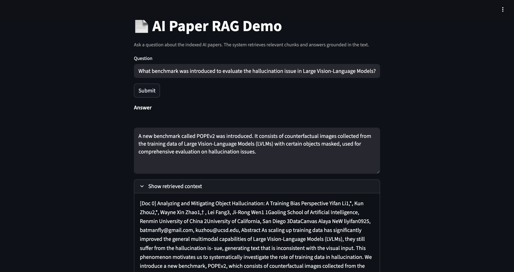

# AI Paper Retrieval-Augmented Generation (RAG) System

## Overview
This project implements a **retrieval-augmented generation pipeline** for **150 AI research papers**, enabling accurate, context-aware answers to technical questions.  
The system is built with **LangChain**, **FAISS**, and **HuggingFace Transformers**, delivering an end-to-end solution from data processing to automated evaluation.

## Features
- **Full RAG Pipeline**: Data cleaning (control/whitespace normalization), chunking via `RecursiveCharacterTextSplitter`, FAISS indexing, dense retrieval, reranking, and answer generation.
- **Dense Retrieval + Reranking**:  
  - Retriever: [`BAAI/bge-large-en-v1.5`](https://huggingface.co/BAAI/bge-large-en-v1.5)  
  - Cross-encoder reranker: [`BAAI/bge-reranker-v2-m3`](https://huggingface.co/BAAI/bge-reranker-v2-m3)  
  - Performance: **Recall@1** ↑ 0.84 → 0.94, **MRR@10** ↑ 0.8732 → 0.9643.
- **Optimized Retrieval Pipeline**:  
  Single-chunk-first search with adaptive multi-chunk expansion and same-source diversity constraints.  
  Improved average **accuracy** 0.71 → 0.866 without excessive context length.
- **LLM-based Evaluation**:  
  Structured JSON input (`question`, `reference_answer`, `evidence`) scored on a 5-level rubric.  
  Automatically reports **Recall@k**, **MRR@10**, and score distribution.  
  Fully **config-driven** (`--config` YAML) for reproducible batch experiments.

## Tech Stack
- **Frameworks**: LangChain, FAISS, HuggingFace Transformers
- **Models**: `BAAI/bge-large-en-v1.5`, `BAAI/bge-reranker-v2-m3`, LLM-as-a-judge
- **Language**: Python 3.10+
- **Evaluation**: Custom pipeline with YAML configs

## Quick Start
```bash
# 1. Install dependencies
pip install -r requirements.txt

# 2. Configure settings
cp configs/default.yaml configs/local.yaml
# Edit local.yaml as needed

# 3. Build FAISS index
python scripts/build_index.py --config configs/local.yaml

# 4. Run retrieval + generation
python scripts/run_rag.py --config configs/local.yaml

# 5. Evaluate performance
python scripts/evaluate.py --config configs/local.yaml
